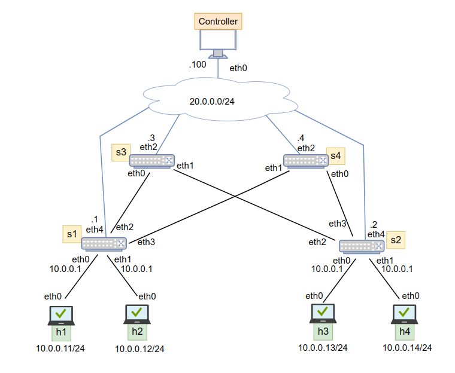

# 07-POX Host Discovery

## Introduction

POX allows the Match-Action table for the forwarding, but with fixed headers and actions. 

The match structure is defined in pox/openflow/libopenflow_01.py in class ofp_match:
- `in_port`: Switch port number the packet arrived on.
- `dl_src`: Ethernet source address.
- `dl_dst`: Ethernet destination address.
- `dl_vlan`: VLAN ID.
- `dl_vlan_pcp`: VLAN priority.
- `dl_type`: Ethernet type (e.g., 0x0800 = IPv4).
- `nw_tos`: IP TOS/DS bits.
- `nw_proto`: IP next protocol (e.g., 6 = TCP).
- `nw_src`: IP source address.
- `nw_dst`: IP destination address.
- `tp_src`: TCP/UDP source port.
- `tp_dst`: TCP/UDP destination port.

## Lab

We have created a POX Host Discovery application that: 
* uses the POX_Link_Discovery component (with some changes) allowing the controller to know the network topology (switches and link between them)
* after the connection up events, all the hosts are discovered (their links with the switches)



### Test the implementation

Launch ```kathara lstart``` in the main terminal, wait until the lab is created

Launch ```kathara connect controller``` in the main terminal

Launch ```python3.9 /pox/pox.py openflow.of_01 -port=6653 host_discovery``` in the root@controller

You will obtain: 
```
POX 0.7.0 (gar) / Copyright 2011-2020 James McCauley, et al.
WARNING:version:POX requires one of the following versions of Python: 3.6 3.7 3.8 3.9
WARNING:version:You're running Python 3.11.
WARNING:version:If you run into problems, try using a supported version.
INFO:core:POX 0.7.0 (gar) is up.
INFO:openflow.of_01:[96-42-18-c8-bb-4c 1] connected
INFO:openflow.of_01:[f2-7d-06-c5-98-49 2] connected
INFO:openflow.of_01:[5e-be-f2-52-2b-41 3] connected
INFO:openflow.of_01:[6e-c1-57-1b-88-4c 4] connected
```

Then, there are the discovered hosts:
```
host discovering
INFO:host_discovery:  ->  host 10.0.0.11 is connected to switch ([2], 'f2-7d-06-c5-98-49') through switch port 1
INFO:host_discovery:  ->  host 10.0.0.12 is connected to switch ([2], 'f2-7d-06-c5-98-49') through switch port 2
INFO:host_discovery:  ->  host 10.0.0.14 is connected to switch ([4], '6e-c1-57-1b-88-4c') through switch port 2
INFO:host_discovery:  ->  host 10.0.0.13 is connected to switch ([4], '6e-c1-57-1b-88-4c') through switch port 1
```


When you close the application, you obtain the disconnection from the switches:
```
INFO:openflow.of_01:[9e-8c-f4-ec-9c-4e 1] disconnected
INFO:openflow.of_01:[d2-37-cc-c7-70-41 2] disconnected
INFO:openflow.of_01:[86-94-e5-ad-df-42 3] disconnected
INFO:openflow.of_01:[b6-50-bc-90-a9-4d 4] disconnected
INFO:core:Down.
```

Close the root@controller with ```exit```

Close the lab with ```kathara lclean```
