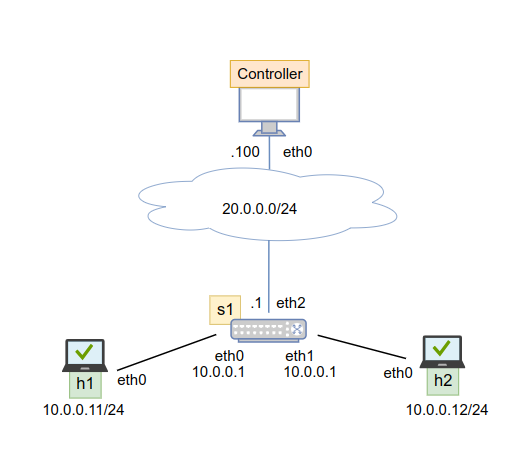

# 08-POX ARP Handler

## Introduction

POX allows the Match-Action table for the forwarding, but with fixed headers and actions. 

OpenFlow actions are applied to packets that match a rule installed at the datapath. Forward packets out of a physical or virtual port. Port attribute value can be chosen among the following options: 
- `OFPP_IN_PORT`: Port to send the packet back out of the input port.
- `OFPP_NORMAL`: Process normally and let the OpenFlow switch determine the output port.
- `OFPP_FLOOD`: Send the packet to all ports except the input port and those with flooding disabled.
- `OFPP_ALL`: Send the packet to all ports, including the input port.
- `OFPP_CONTROLLER`: Send to the OpenFlow controller for processing.
- `OFPP_LOCAL`: Deliver to the local OpenFlow switch.
- `OFPP_NONE`: Drop the packet, no output port.

## Lab

We have created a POX ARP Handler application that: 
- the host discovery component of the previous lab (with some small changes), to know the hosts of the network
- a component that answers to ARP requests of the hosts (assume that the gateway is at 10.0.0.1): if the destination IP is a host, it answers with the correct MAC; if the destination IP is the gateway or external, it answers with a fake MAC



### Test the implementation

To run the network scenario, open a terminal in the scenario directory and type:
```bash
kathara lstart 
```

Launch in the root@controller:
```
python3.9 /pox/pox.py openflow.of_01 -port=6653 component_ARP host_discovery
```

You will obtain: 
```
POX 0.7.0 (gar) / Copyright 2011-2020 James McCauley, et al.
WARNING:version:Support for Python 3 is experimental.
INFO:core:POX 0.7.0 (gar) is up.
INFO:openflow.of_01:[32-b2-97-d3-8b-40 2] connected
host discovering
INFO:host_discovery:  ->  host 10.0.0.11 is connected to switch ([1], '32-b2-97-d3-8b-40') through switch port 1
INFO:host_discovery:  ->  host 10.0.0.12 is connected to switch ([1], '32-b2-97-d3-8b-40') through switch port 2
```

Now, we try some ping to see the response of the ARP handler. 

Launch in `h1` terminal the command:
```
ping 10.0.0.12
``` 

You will have a first print that shows the ARP request of `h1` and then a print that represents the ARP reply with the MAC of `h2`:
```
INFO:component_ARP:ARP, Request who-has 10.0.0.12 tell 10.0.0.11
INFO:component_ARP:ARP, Reply 10.0.0.12 is-at 32:1a:b0:d4:aa:82
```

Then, try to do a different ping, Launch in `h1` terminal the command:
```
ping 20.0.0.1
```

Because it is not a known host, the ARP reply contains a fake MAC:
```
INFO:component_ARP:ARP, Request who-has 10.0.0.1 tell 10.0.0.11
INFO:component_ARP:ARP, Reply 10.0.0.1 is-at 11:11:11:11:11:11
```

When you close the application, you obtain the disconnection from the switches:
```
INFO:openflow.of_01:[9e-8c-f4-ec-9c-4e 1] disconnected
INFO:openflow.of_01:[d2-37-cc-c7-70-41 2] disconnected
INFO:openflow.of_01:[86-94-e5-ad-df-42 3] disconnected
INFO:openflow.of_01:[b6-50-bc-90-a9-4d 4] disconnected
INFO:core:Down.
```

To undeploy the network scenario, open a terminal in the network scenario directory and type:
```bash
kathara lclean
```
