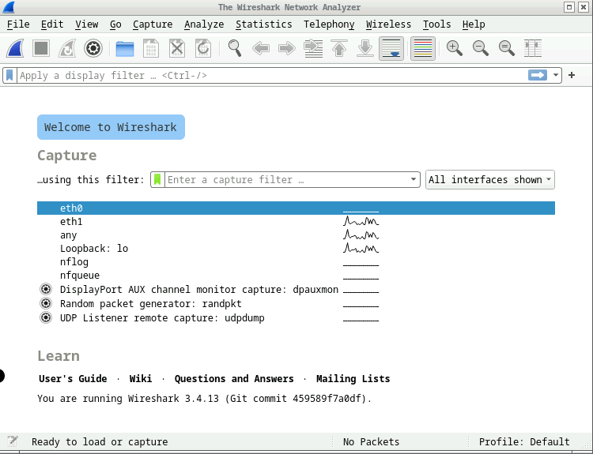
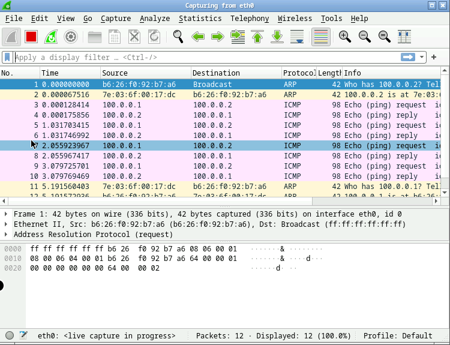

# Capture Packets using Wireshark GUI

This tutorial explain how to capture packets of a collision domain using Wireshark.

Thanks to [nopid](https://github.com/nopid) and [whatever4711](https://github.com/whatever4711) for suggesting this brilliant solution! :rocket:

## Docker Desktop Compatibility
Due to a Docker Desktop issue currently the port forwarding smoothly works only on linux (KatharaFramework/Kathara#230). 
However, if you are using **Docker Desktop** it is possible to circumvent the problem using the `lconfig command`,
as described by the issue KatharaFramework/Kathara#230.


## Let's start!
Let's consider the simple network scenario in the [lab](lab) directory, that is composed by two devices, namely 
`pc1` and `pc2`

Suppose you want to capture packets between the two devices `pc1` and `pc2` on the collision domain `A`.

This is the `.startup` file of `pc1`:
```bash
ip address add 100.0.0.1/24 dev eth0
```
And this is the `.startup` file of `pc2`:
```bash
ip address add 100.0.0.2/24 dev eth0
```
To do so you have to add a `wireshark` device to the network scenario (in the [lab.conf](lab/lab.conf) file) 
connected to the collision domain to sniff.

```txt
pc1[0]=A
pc2[0]=A

wireshark[0]=A
wireshark[bridged]=true
wireshark[port]="3000:3000/tcp"
wireshark[image]="lscr.io/linuxserver/wireshark"
```

Note that to capture packets on more than one collision domain, you only need to connect the `wireshark` device on desired collision domains. 

The `wireshark` device uses the `lscr.io/linuxserver/wireshark` image, which exposes a Wireshark GUI accessible using 
a web browser.
The `wireshark[port]="3000:3000/tcp` entry exposes port `3000` of the container to port `3000` on the host. 
In this way you can connect to the wireshark container GUI with your browser on 'localhost:3000'.


### Docker Desktop 
If you are using Docker Desktop on MacOS or Windows, you need to use the following `lab.conf` file:
```txt
pc1[0]=A
pc2[0]=A

wireshark[bridged]=true
wireshark[port]="3000:3000/tcp"
wireshark[image]="lscr.io/linuxserver/wireshark"
```
And then manually connect the `wireshark` device to collision domain `A` using the following command: 
```shell
kathara lconfig -n wireshark --add A
```

### The Wireshark GUI
You can connect to the GUI following these steps:

1. Access the GUI through a web browser using the following URL:
   - [http://localhost:3000/](http://localhost:3000/)
   By default, the user/pass is abc/abc. If you change your password or want to log in manually to the GUI session for 
   any reason use the following link: [http://localhost:3000/?login=true](http://localhost:3000/?login=true)`

2. You can select the interface connected to the collision domain to sniff (e.g., `eth0`).
   

3. Now, you can see packets exchanged on that collision domain between the devices.
   

