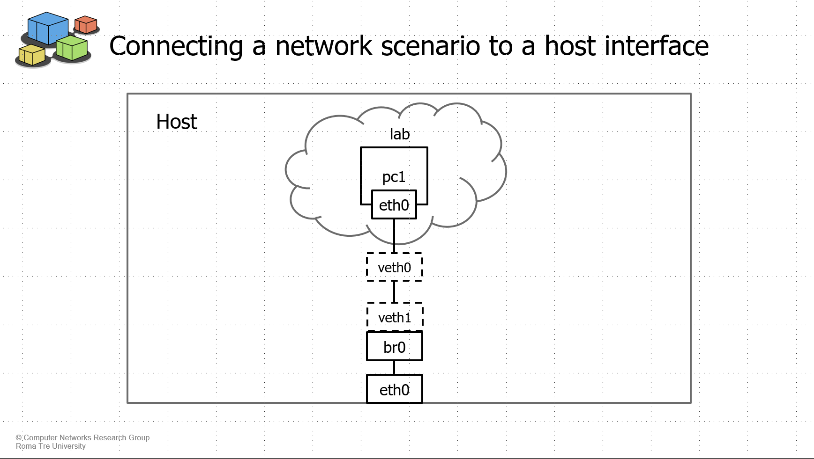

# Kathará External - Communicating with the host (Linux Only)

This tutorial shows a simple example on how to allow a network scenario to directly communicate with a host interface.

The same procedure can be used to connect a network scenario to a VM, a container, or another network scenario running
on the host executing the emulation.

The tutorial works only on Linux. It works even on WSL, if you install Docker directly from Linux  
(not using the Docker Desktop installed on the Windows host).

## Configuration

In this example we want to allow communication between a simple network scenario and a host interface.
We use a simple scenario ([lab](lab)) composed of only one device, called `pc1`.

We will configure a bridge on the host that connects the device in the network scenario with the interface `eth0` on the
host.

### Configuring the bridge and veth interfaces

Before running the emulation, we need to configure the host to permit the communication between `pc1` in the network
scenario and the interface `eth0` on the host.

We start creating a bridge (`br0`) on the host:

```bash
sudo ip link add br0 type bridge
```

Then, we create a veth pair that will be used to connect `pc1` to `br0`.

```bash
sudo ip link add dev veth0 type veth peer name veth1
sudo ip link set veth0 up
sudo ip link set veth1 up
```

We can connect `veth0` to `pc1` by using the `lab.ext` file. So, in the [lab.ext](lab/lab.ext) we have:

```
A veth0
```

Then, we have to add `veth1` to the bridge:

```bash
sudo ip link set veth0 master br0
```

To allow communication with `pc1` and the `eth0` on the container, we also need to enslave `eth0` to `br0`:

```bash
sudo ip link set eth0 master br0
```

Finally, we need to add an `iptables` rule to permit all the packets transiting on `br0`:

```bash
sudo iptables -A FORWARD -i br0 -o br0 -j ACCEPT
```

### Running the emulation

At this point we are ready to run the network scenario. Open a terminal and go inside the [lab](lab) directory. Then,
run the following command:

```bash
sudo kathara lstart 
```

On the host, we should have a topology like the following: 



`pc1` is configured to have IP address `10.0.0.1/24` and a default route on `eth0` ([pc1.startup](lab/pc1.startup))

To permit the communication we only need to add a route on the host to specify that the prefix `10.0.0.0/24` is
reachable through the bridge `br0`.
```bash
ip route add 10.0.0.0/24 dev br0
```
