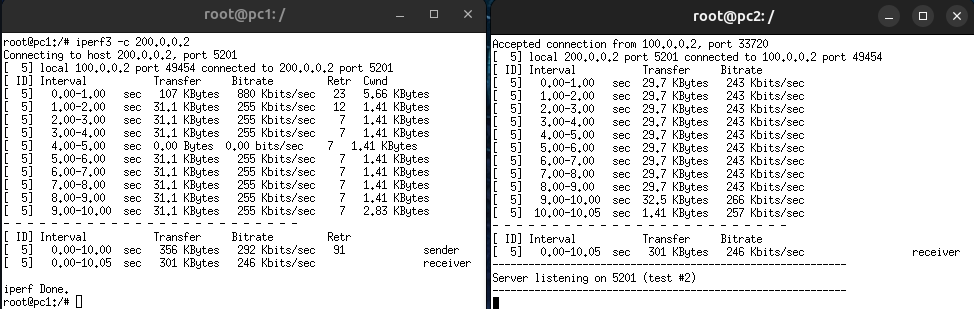

# Limit Bandwidth
This simple example shows how to limit bandwidth on a device interface. 

## Configuring the lab
For this example we consider the following `lab.conf` file:

```shell
pc1[0]="A"
pc1[image]="kathara/base"

r1[0]="A"
r1[1]="B"
r1[image]="kathara/base"

pc2[0]="B"
pc2[image]="kathara/base"
```

Our goal is to limit the bandwidth on `eth1` of `r1`. 

We start configuring `pc1`. To do so, we create a `pc1.startup` file with the following content: 
```shell
ip address add 100.0.0.2/24 dev eth0

ip route add default via 100.0.0.1 dev eth0
```

Then we do the same thing for the `pc2.startup` file:
```shell
ip address add 200.0.0.2/24 dev eth0

ip route add default via 200.0.0.1 dev eth0
```

Now we are ready to configure `r1`, writing its `r1.startup` file:
```shell
ip address add 100.0.0.1/24 dev eth0
ip address add 200.0.0.1/24 dev eth1

tc qdisc add dev eth1 root tbf rate 256kbit buffer 2kb latency 10ms
```

The last line tells to `tc` to add a Token Bucket Filter (*tbf*) on `eth0` to limit bandwidth to `256kbps`.
The `buffer` parameter sets the size of the bucket (`2kbit`) and the `latency` sets the maximum amount of time a packet 
can sit in the TBF.

To test the effectiveness of the command let's use `iperf3` to test the bandwidth between `pc1` and `pc2`:



As it is possible to notice, the bandwidth between the two devices is limited to `256kbps`!

You can find the complete configuration of devices in the [lab](lab) directory.

For more details on the `tc` command, see the [man-pages](https://man7.org/linux/man-pages/man8/tc.8.html).
